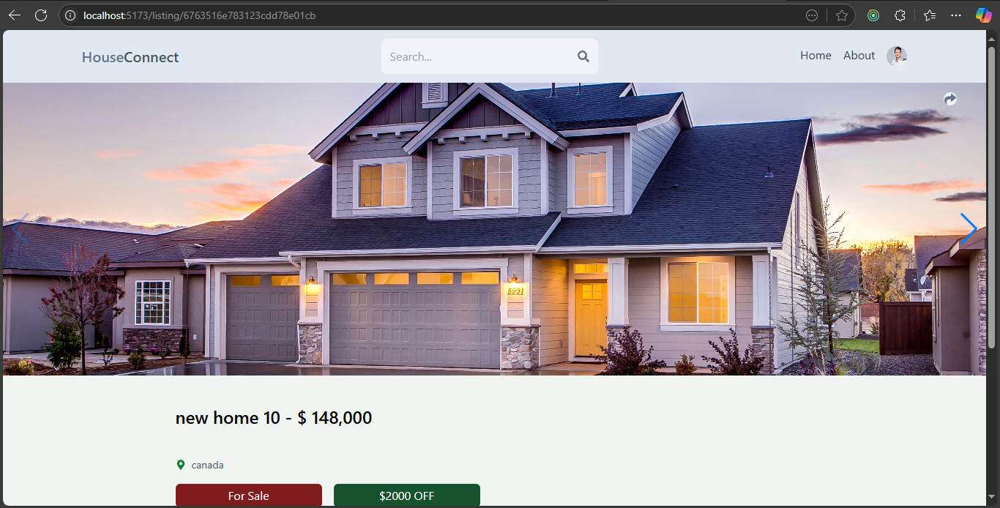

# **HouseConnect - Real Estate Marketplace**

### **Overview**  
HouseConnect is a dynamic web application that enables users to seamlessly buy, sell, and rent properties. With a user-friendly interface, secure authentication, and advanced property search features, the platform provides a reliable solution for real estate transactions.

---

### **Live Demo**  
[**Access HouseConnect Here**](https://houseconnect.onrender.com/)  

---

### **Features**  
- **Property Listings:** Users can list properties for sale, rent, or purchase.  
- **Advanced Search & Filters:** Search by location, price range, property type, and more.  
- **Secure Authentication:** User registration, login, and account management.  
- **Responsive Design:** Optimized for devices of all sizes.  
- **Interactive Dashboard:** Manage your listed properties and view activity.  

---

### **Technologies Used**  
- **Frontend:** React.js, Tailwind CSS  
- **Backend:** Node.js, Express.js  
- **Database:** MongoDB  
- **State Management:** Redux
- **Hosting & Authentication:** Firebase, Render

---

### **Setup Instructions**  

1. **Clone the Repository**  
   ```bash
   git clone https://github.com/prabanj10/RealEstate-MERN.git
   cd houseconnect
   ```

2. **Install Dependencies**  
   - In the root folder (backend):  
     ```bash
     npm install
     ```  
   - Navigate to the client folder (frontend):  
     ```bash
     cd client
     npm install
     ```

3. **Set Environment Variables**  
   - In the root folder, create a `.env` file and add:  
     ```env
     MONGO_URI=your-mongodb-connection-string
     JWT_SECRET=your-jwt-secret
     FIREBASE_API_KEY=your-firebase-api-key
     ```

4. **Run the Development Servers**  
   - In the **root folder**, start the backend server:  
     ```bash
     npm run dev
     ```  
   - In the **client folder**, start the frontend server:  
     ```bash
     npm run dev
     ```  

5. **Access the App**  
   - Frontend: Open `http://localhost:5173` in your browser.  
   - Backend:  `http://localhost:3000`

---

### **Screenshots**

- **Homepage**  
  
  
  

- **Search Result**  
  

- **Listed House**  
  
  


---

### **Future Enhancements**  
- Integrating payment gateways for property transactions.  
- Adding geolocation-based property searches.  
- Implementing real-time chat between buyers and sellers.

---

### **Contributing**  
Contributions are welcome! Please open an issue or submit a pull request for any suggestions or improvements.

